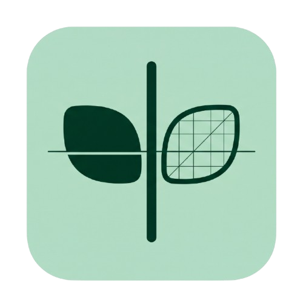
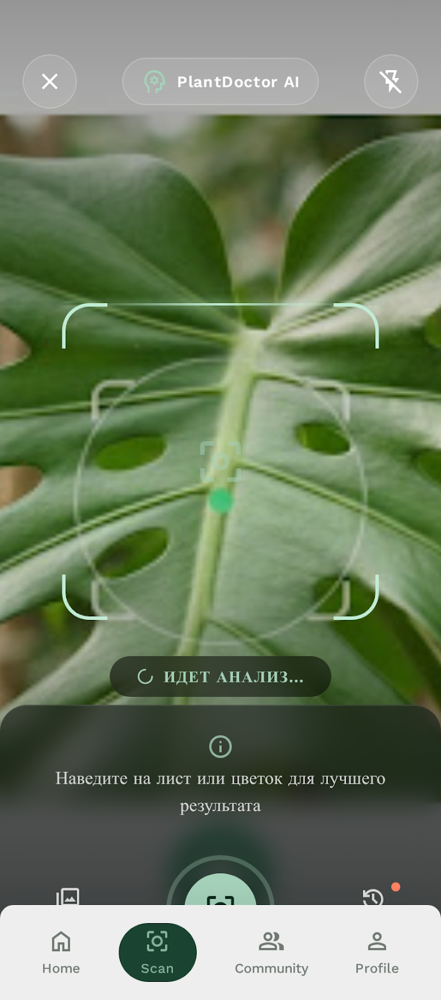
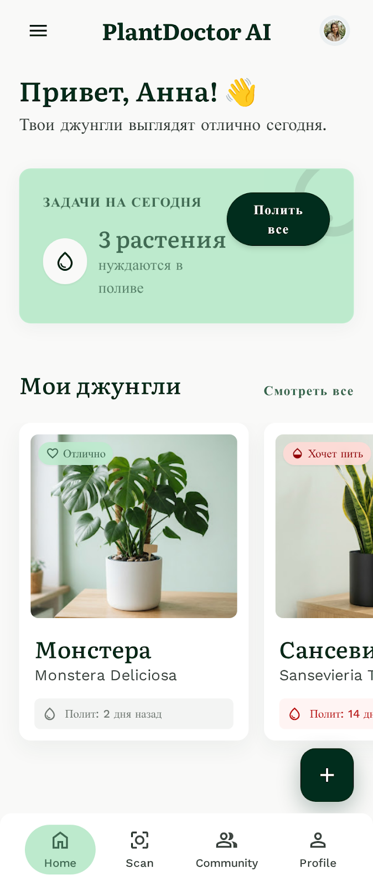
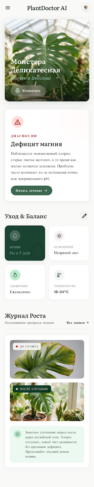

  

# Sprout AI 🌱
### Карманный эксперт-ботаник в вашем телефоне

**Sprout AI** — это интеллектуальный ассистент для ухода за растениями, который сочетает в себе современные технологии искусственного интеллекта и эстетичный, успокаивающий дизайн. Наше приложение создано для того, чтобы помочь любителям растений вырастить свой собственный цветущий сад без лишней тревоги.

---

## ✨ Основные возможности

### 📸 1. Мгновенная ИИ-диагностика
Достаточно сделать одну фотографию, чтобы определить вид вашего растения, оценить уровень его здоровья от 0 до 100%, поставить точный диагноз и получить пошаговый план лечения и ухода.

### 💧 2. Умные напоминания о поливе
Интеллектуальная система автоматически рассчитывает интервалы полива и удобрения для каждого растения, учитывая его состояние и динамику выздоровления.

### 📖 3. Дневник «До / После»
Следите за прогрессом ваших растений в динамике. Фиксируйте этапы роста, делайте заметки и сравнивайте фотографии, чтобы видеть реальные результаты вашей заботы.

### 💬 4. Зеленое комьюнити
Делитесь успехами со своими единомышленниками. Публикуйте фотографии ваших любимцев, обменивайтесь советами, ставьте лайки и комментируйте посты в социальной ленте Sprout AI.

---

## 🎨 Дизайн-система «Botanical Modern»

Визуальный стиль Sprout AI построен на философии **"Forest to Soil"** (От леса к почве), сочетающей технологическую лаконичность с природным теплом:
* **Цветовая палитра:** Глубокий лесной зеленый (Primary), мягкие фоновые оттенки шалфея и мяты, и теплый терракотовый акцент для уведомлений, требующих внимания.
* **Типографика:** Элегантный засеченный шрифт **Literata** для заголовков создает ощущение премиального ботанического журнала, а легкий **Work Sans** обеспечивает высокую читаемость данных по уходу.
* **Формы:** Мягкие, скругленные углы (24px) карточек и элементов интерфейса делают приложение визуально уютным и дружелюбным.

---

## 📱 Интерфейс приложения

  
  
  
  

---

## 🌟 Sprout AI Pro
Для тех, кто хочет максимум заботы о своем саде, предусмотрена Pro-версия:
* **Безлимитные сканирования** ИИ (на бесплатном плане доступно 5 сканирований в месяц).
* **Контекстный анализ динамики:** ИИ запоминает предыдущую историю болезни растения при повторном сканировании и оценивает эффективность лечения.
* **Эксклюзивные советы** по редким видам растений.
